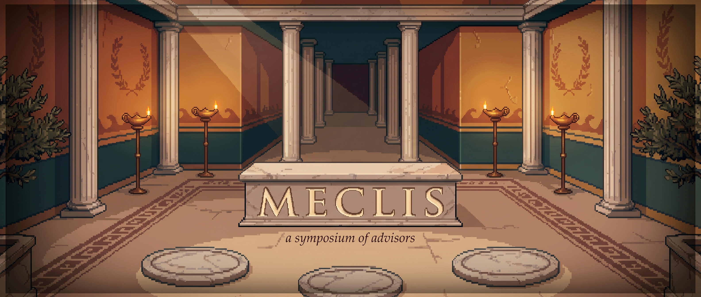

<p align="center">
  
</p>

<h1 align="center">meclis</h1>

<p align="center">
  A 2D pixel-art viewer for Claude Code's <code>/meclis</code> skill.<br />
  Watch your AI advisors deliberate as characters on a stage.
</p>

<p align="center">
  <a href="#quickstart"></a>
  <a href="#license"></a>
  
</p>

---

## What this is

A local web app that turns Claude Code's `/meclis` invocations into a live, watchable scene. When the skill dispatches a sub-agent for a named advisor — Paul Graham, Robert Greene, Seth Godin, anyone you add — the dispatch is mirrored to a tiny local server through hooks, then streamed to a browser tab where each advisor appears as a 2D character with speech and thought bubbles.

**No `ANTHROPIC_API_KEY`. No orchestration.** Your existing Claude Code subscription does the actual work. `meclis` is a window onto it.

The character cast is read straight from `~/.claude/skills/meclis/advisors/*.md`, so adding a new advisor is one file on disk away. See [Adding your own advisor](#adding-your-own-advisor) below.

## How it works

```
 ┌─ Claude Code ────────────────┐    ┌─ meclis server ─┐    ┌─ meclis viewer ─┐
 │                              │    │                 │    │                 │
 │  /meclis should I learn Go? │    │   POST          │    │   SSE stream    │
 │       │                      │    │   /api/meclis/  │    │   /api/meclis/  │
 │       ▼                      │    │   hooks/event   │    │   stream        │
 │  Agent  Agent  Agent         │    │                 │    │                 │
 │   PG     SG     RG           │ ─► │   in-memory bus │ ─► │   PIXI scene    │
 │       │                      │    │                 │    │                 │
 │       ▼ PreToolUse hook      │    │                 │    │   parchment     │
 │       ▼ PostToolUse hook     │    │                 │    │   bubbles +     │
 │       ▼ SubagentStop hook    │    │                 │    │   transcript    │
 └──────────────────────────────┘    └─────────────────┘    └─────────────────┘
```

1. You run `/meclis …` in Claude Code.
2. The meclis skill spawns an `Agent` sub-agent per advisor, passing each one the matching character pack from disk.
3. Three hooks installed in `~/.claude/settings.json` (`PreToolUse`, `PostToolUse`, `SubagentStop` with matcher `Agent`) fire on every dispatch. The hook script identifies whether the prompt belongs to a known advisor and, if so, POSTs a small event to `meclis`.
4. The `meclis` server holds an in-memory bus and broadcasts events over SSE. Any browser tab pointed at `http://localhost:5173` is the stage.
5. Characters appear, take a thinking pose, then speak as their answers stream in. Click any character to spotlight their bubble. The codex panel on the right keeps the full transcript.

## Quickstart

> Requires Node 20+, pnpm 9+, and an installed `/meclis` skill at `~/.claude/skills/meclis/`.

```bash
git clone git@github.com:woosal1337/meclis.git
cd meclis
pnpm install

# 1. start the server (any persistent terminal)
pnpm dev:server                         # listens on http://localhost:3001

# 2. install the hooks into ~/.claude/settings.json (idempotent, makes a .bak)
pnpm install-hooks

# 3. open the viewer (any time, leave the tab open)
pnpm dev:web                            # http://localhost:5173
```

Then in any Claude Code session:

```
/meclis should I raise a seed round now or wait for traction?
```

You'll see the advisors wake up, sit in a thinking pose while the sub-agents work, and type out their answers as the model returns text.

To turn the integration off:

```bash
node scripts/install-hooks.mjs --uninstall
```

## Adding your own advisor

The cast is auto-discovered from the filesystem — no code changes required.

1. Drop a markdown character pack at `~/.claude/skills/meclis/advisors/<slug>.md`. The pack's first line must be `# <Display Name>` so the hook can identify them.
2. Optional: drop a `896×1200` PNG sprite at `apps/web/public/assets/sprites/<slug>.png`. If you don't, `meclis` falls back to a colored silhouette derived from the slug.
3. Reload the viewer. Your new advisor appears in the speakers panel and on stage.

A character pack should describe identity, voice rules, frameworks, and signature quotes. The repo includes Paul Graham, Seth Godin, and Robert Greene as worked examples in `apps/web/public/assets/sprites/` and as advisor packs the user installs separately. See [`docs/authoring-advisors.md`](docs/authoring-advisors.md) for the full structure and [`scripts/generate-sprites.md`](scripts/generate-sprites.md) for a Gemini-based sprite-generation prompt that matches the existing visual style.

## Project layout

```
meclis/
├── apps/
│   ├── web/         Vite + React + TypeScript + PixiJS frontend
│   └── server/      Node + Hono backend (event bus + SSE broadcaster)
├── packages/
│   └── shared/      Event types shared between web and server
├── scripts/
│   ├── hooks/agent-event.mjs     the hook script Claude Code calls
│   ├── install-hooks.mjs         idempotent settings.json patcher
│   └── generate-sprites.md       Gemini prompt for new advisor sprites
├── assets/
│   ├── banner.png                README banner
│   └── sprites/                  master copies of generated sprites
└── docs/
    └── authoring-advisors.md     guide for adding new advisors
```

## Configuration

Most things just work. The few env knobs the hook script honors:

| variable | default | purpose |
|---|---|---|
| `MECLIS_URL` | `http://localhost:3001` | where the hook posts events |
| `MECLIS_SECRET` | `local-only-meclis` | shared secret between hook and server |
| `MECLIS_ADVISOR_DIR` | `~/.claude/skills/meclis/advisors` | where advisor packs live |
| `MECLIS_DEBUG` | unset | set to anything to log hook decisions to stderr |

Server env (`apps/server/.env`):

| variable | default | purpose |
|---|---|---|
| `PORT` | `3001` | server port |
| `WEB_ORIGIN` | `http://localhost:5173` | CORS origin for the viewer |
| `ADVISOR_DIR` | `~/.claude/skills/meclis/advisors` | same as above, server-side |

## Resetting the session

There are three ways to clear the running session and start fresh:

1. Click **NEW SESSION** in the viewer header (cleanest).
2. `curl -X POST http://localhost:3001/api/meclis/reset` (no UI required).
3. Restart the server — the in-memory bus resets along with it.

## Production build

```bash
pnpm build           # builds web + server
pnpm --filter @meclis/server start
pnpm --filter @meclis/web preview
```

## Contributing

Issues and PRs are welcome. Especially valued: new advisor packs, sprite contributions in the matching style, alternative themes, and mid-turn streaming via session-jsonl tailing. See [CONTRIBUTING.md](CONTRIBUTING.md) for the open threads.

## License

MIT — see [LICENSE](LICENSE).
